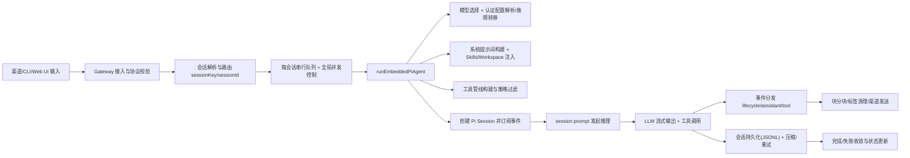

## 1) 系统总体设计（OpenClaw）

OpenClaw 以 Gateway 为中心，形成「消息接入 → 会话路由 → Agent 执行 → 工具编排 → 流式回复 → 持久化/运维」闭环：

- 控制平面与协议：server.ts、schema.ts、index.ts
- Agent 主执行入口：`runEmbeddedPiAgent`
- 事件订阅与流式分发：`subscribeEmbeddedPiSession`
- 系统提示词构建：`buildAgentSystemPrompt`
- 工具装配：`createOpenClawCodingTools`、pi-tool-definition-adapter.ts
- 模型与认证：model-auth.ts、auth-profiles.ts、model-selection.ts
- 流式分块：`EmbeddedBlockChunker`
- 扩展与保护：context-pruning.ts、compaction-safeguard.ts

## 2) 总体流程图（端到端）

## 3) 核心算法重点说明

### A. 会话串行化与并发控制（正确性核心）

- 目标：同一会话内严格串行，避免工具副作用乱序。
- 机制：`agent` 请求快速受理后，真实执行在 `agentCommand` 进入队列，最终落到 `runEmbeddedPiAgent`。
- 价值：保证「会话状态一致性 > 吞吐」，是整个系统的主不变量。

### B. 模型解析 + 认证故障转移（可用性核心）

- 入口文件：model-selection.ts、model-auth.ts、auth-profiles.ts
- 关键点：主模型/回退模型、认证 profile 冷却与轮换。
- 价值：在 token 过期、供应商抖动时维持连续服务。

### C. 工具编排与策略过滤（安全核心）

- 工具来源：内置 coding tools + OpenClaw tools + 渠道工具。
- 装配链路：`createOpenClawCodingTools` → pi-tool-definition-adapter.ts → 策略过滤。
- 价值：把“能不能调、在哪能调、给谁调”收敛到策略层，而不是散落在业务代码。

### D. 提供商特异修正（兼容性核心）

- 重点是 transcript hygiene 与 schema 清理（如 Gemini/OpenAI 的约束差异）。
- 相关实现入口：google.ts、pi-tools.schema.ts、pi-embedded-helpers.ts
- 价值：用“运行前内存修正”换取跨供应商稳定性，不污染磁盘原始会话。

### E. 流式分块与回复整形（体验核心）

- 组件：`subscribeEmbeddedPiSession`、`EmbeddedBlockChunker`
- 处理：增量流 → 思考/最终标签处理 → 软分块 → 渠道能力适配发送。
- 价值：降低重复、截断、超长消息失败，提升多渠道一致体验。

### F. 上下文窗口保护与压缩（成本/稳定性核心）

- 组件：context-window-guard.ts、compaction-safeguard.ts、context-pruning.ts
- 机制：窗口预检、自动/手动压缩、上下文修剪、重试收敛。
- 价值：避免 context-too-large 和重复输出，控制 token 成本。

## 4) 设计要点（可直接用于评审）

- **单一事实源**：Gateway 维护会话、路由、连接状态（协议强约束）。
- **执行与传输解耦**：Agent loop 专注推理/工具；Gateway 专注连接/路由/状态。
- **策略前置**：工具权限与模型策略在运行前决策，减少运行时风险。
- **事件驱动可观测**：lifecycle/assistant/tool 流统一，便于 UI 与诊断扩展。
- **兼容层集中化**：供应商差异集中在 sanitize/adapter 层，业务层保持稳定。
